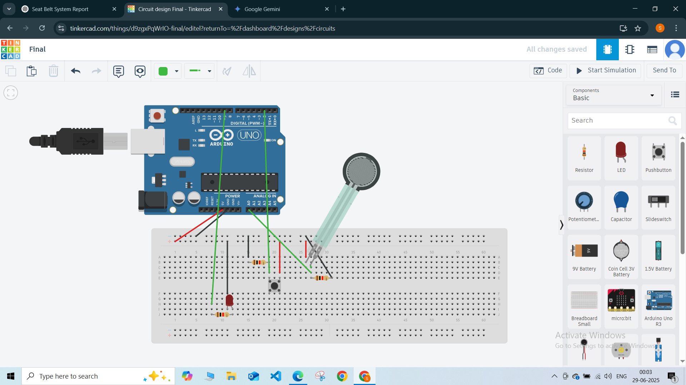

# Smart Seatbelt Reminder System 🚗🔔

This is a prototype I built as a part of my KPIT NOVA Training (C & Embedded Systems).  
It detects seat occupancy and whether a seatbelt is fastened and gives a visual alert if the seat is occupied but the seatbelt is not fastened.

---

## 🔧 Components
- Arduino Uno
- Force Sensitive Resistor (DIY)
- Push Button
- LED (with 220Ω resistor)
- 2.2kΩ resistor for FSR voltage divider
- Breadboard & jumper wires

---

## ⚙️ Logic
| Seat Occupied (FSR) | Seatbelt Fastened (Button) | LED Alert |
|---------------------|----------------------------|-----------|
| No                  | Doesn't Matter             | OFF       |
| Yes                 | Fastened                   | OFF       |
| Yes                 | Not Fastened               | ON        |

---

## 📷 Simulation

---

## 💻 Code
See [`code/seatbelt_reminder.ino`](code/seatbelt_reminder.ino) for the Arduino sketch.

---

## 🧾 Report
See [`report/Smart_Seatbelt_Reminder_System_Report.pdf`](report/Smart_Seatbelt_Reminder_System_Report.pdf) for the detailed documentation.

---

## ✨ Reflection
This was my first embedded prototype integrating sensors and logic.  
It helped me understand:
- Input pull-up logic
- Voltage dividers
- Debugging through serial monitor

---

*Created during my KPIT NOVA Training journey. The performance assessment was ongoing at the time of submission. Regardless of the outcome, I’m sharing it here to document my learning and growth.*
